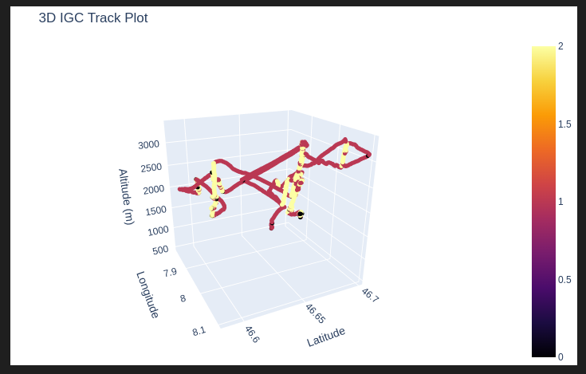
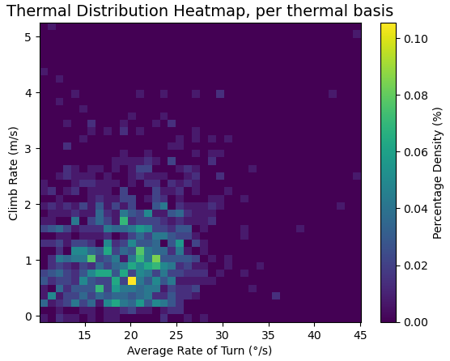
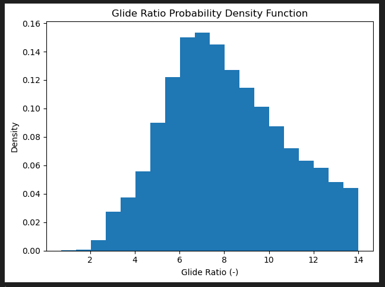
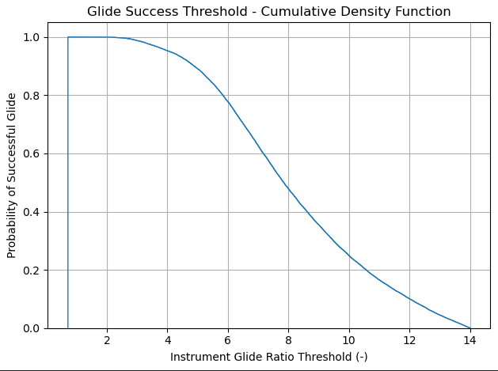

# FalqinParaLib

© René Falquier holds exclusive copyright to the Falqin logo (2025), which is authorized to be used royalty-free only in connection with FalqinParaLib.

# WORK IN PROGRESS, REMAINING SECTIONS TBC

# Summary
## Project Intro/Objective
The purpose of this project is ________. (Describe the main goals of the project. Limit to a short paragraph, 3-6 Sentences)

**Motivation:** Explain the need for your project in a few words
**Goal:** write a concrete goal for your project
**What we propose:** explain the approach you have taken and the results you got so far
**Next Steps:** List the most important tasks that remain to be done
**Structure of the document:** if the document is getting big, outline the structure and explain the different parts

# How to use
**NOTE**: For a low-efficiency airfoil, Oswald efficiency factor e<1, e≈0.8 (typical for non-elliptical lift distributions), AR=7, CD0≈0.025 (higher due to poor efficiency) i.e. max theoretical L/D for a paraglider ≈14.1

**Input Considerations:**
- Importance of sourcing actual XC flights to avoid introducing bias into the data, worth sourcing what that means (e.g. 50km at minimum 15km/h)

**Note to self**
- Separating technical use from interpretation instructions from considerations for choice of input files

### Methods Used
* Inferential Statistics
* Machine Learning
* Data Visualization
* Predictive Modeling
* etc.

### Technologies
* R
* Python
* D3
* PostGres, MySql
* Pandas, jupyter
* HTML
* JavaScript
* etc.

## Getting Started

1. Clone this repo (for help see this [tutorial](https://help.github.com/articles/cloning-a-repository/)).
2. Raw Data is being kept [here](Repo folder containing raw data) within this repo.

    *If using offline data mention that and how they may obtain the data from the froup)*

3. Data processing/transformation scripts are being kept [here](Repo folder containing data processing scripts/notebooks)
4. etc...

*If your project is well underway and setup is fairly complicated (ie. requires installation of many packages)
create another "setup.md" file and link to it here*

5. Follow setup [instructions](Link to file)

## Featured Notebooks/Analysis/Deliverables
* [Notebook/Markdown/Slide Deck Title](link)
* [Notebook/Markdown/Slide DeckTitle](link)
* [Blog Post](link)

## Project Description
(Provide more detailed overview of the project.
Talk a bit about your data sources and what questions and hypothesis you are exploring.
What specific data analysis/visualization and modelling work are you using to solve the
problem? What blockers and challenges are you facing?
Feel free to number or bullet point things here)

# Introduction
(optional) In the introduction, you can explain the context of your project, refine the question you want to ask and outline the plan for the work

Here is an example of including images:

# Part 1 Title
Ideally, your work should be broken down into several parts so that it's easier to have a global view of the work you have done

# Part 2 Title

# Part 3 Title

# Conclusion & Recommendations

write a paragraph on the main results of your work.

write a paragraph on what should be done (further study, or actions...)

## Contributing Members

**Lead (Contacts) : [Full Name](https://github.com/[github handle])**